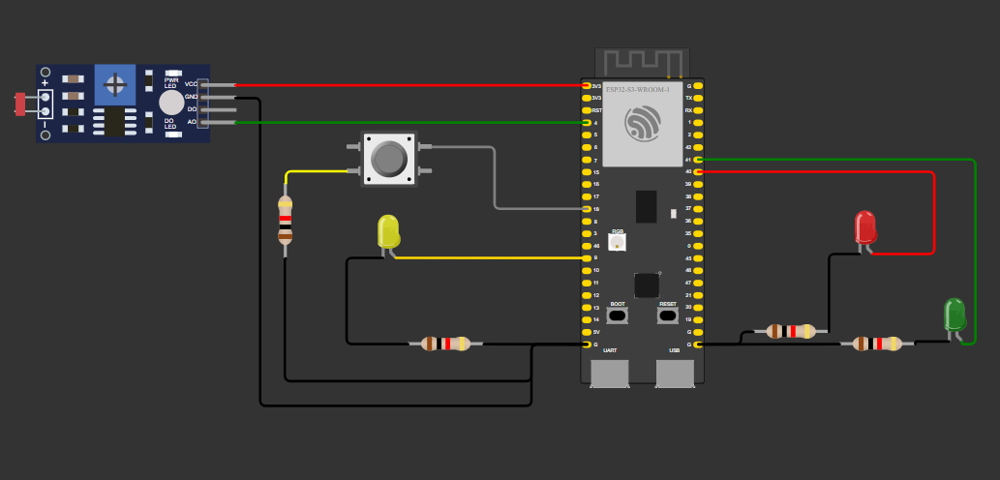
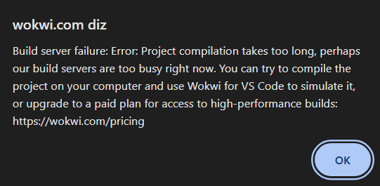

&nbsp;&nbsp;&nbsp;&nbsp; Imagem que demonstra montagem do protótipo

&nbsp;&nbsp;&nbsp;&nbsp; Não fui capaz de tirar prints dos estados do modelo, devido ao erro do wokwi e não ser capaz de conectar ao WiFi. Segue print do erro:
